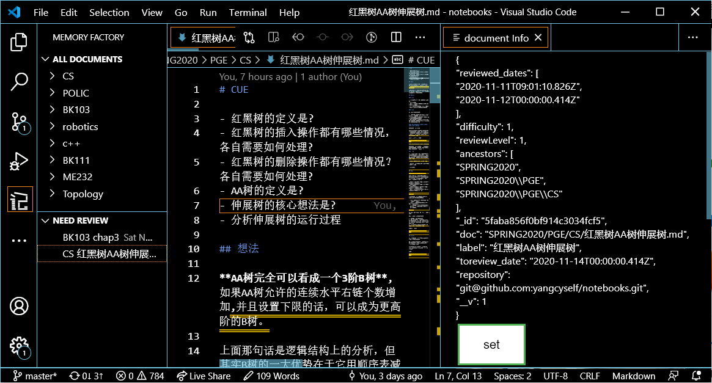

#  &nbsp;&nbsp;Memory Factory - VScode

A vscode extension that organize your documents for review. The extension connects a local MongoDB for storing your review dates and plan, and calculates the date for next review.



## Usage

### Document Operations

The flow for doing documents is:

1. **Add a doc** to memory factory
2. MF generates a date for next time of review.
3. At the planned date for reviewing, the doc will appear at `NEED REVIEW` list.
4. Open the doc and review it. 
5. **Add review date** and choose the date of the reviewing next time.
6. Wait to 3

#### Add doc

Right click on a doc or use `Ctrl+Shift+P` and look for command `Memory Factory: Add doc`

#### Add review date

Right click on a doc or use `Ctrl+Shift+P` and look for command `Memory Factory: Add review date`

#### Show Info Page

Use `Ctrl+Shift+P` and look for command `Memory Factory: show Info Page`. Then click on the target doc.

This will another window showing the record of the document. After modifying its contents, such as `review_level`, you can click `set` to make update it.

#### Delete doc

Right click on a doc or use `Ctrl+Shift+P` and look for command `Memory Factory: delete doc`

#### set toreview date

Right click on an or use `Ctrl+Shift+P` and look for command `Memory Factory: set toreview date`

### Repo Operations

To facilitate the cross-platform potential, the extension recognize repos from its git remote links.

At the first time you use a memory repo, click on the `Add Repo` butten and the repo will be initiated in your database.

### Group Operations


## Get Started

### Build your git repository to review

Initialize a git repository to keep your documents to memorize. Please make sure that the repo have an `origin` url in its `git remote`, as the url is used as an identifier for the repository.

### Install the vscode extension

Install the extension locally following [this link](https://vscode-docs.readthedocs.io/en/stable/extensions/install-extension/)

VS Code looks for extensions under your extensions folder .vscode/extensions. Depending on your platform it is located:

**Git clone this repo into the path of your extension**

- Windows `%USERPROFILE%\.vscode\extensions`
- Mac `$HOME/.vscode/extensions`
- Linux `$HOME/.vscode/extensions`

**Configure the database login**

```bash
# in src
cp serverPassExample.ts serverPass.ts
```

Add then fill in the database information.

**Run the following commend to compile ts.**

```bash
npm run compile
```

### Use

Restart the repo for you to memorize and find the logo in the navigation bar.

## Misc

> Another similar and WEB-based APP can be found at http://mf.iimt.me/login.

### Pack:

```bash
vsce pack--baseContentUrl https://github.com/yangcyself/MemoryFactory-vscode.git
```